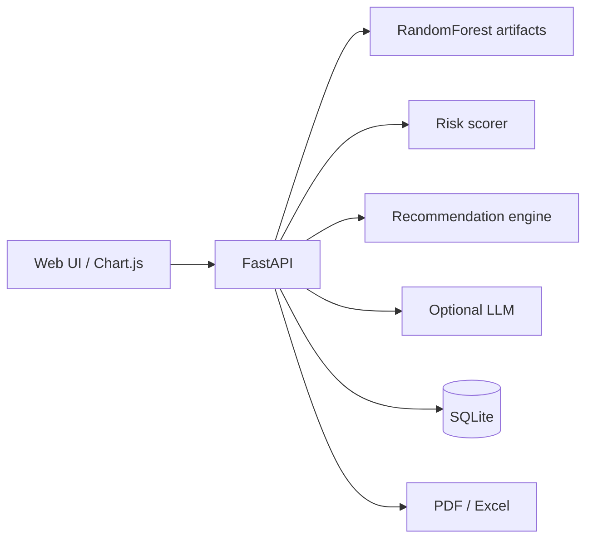

# Week 2 — Recommendation Engine & Analytics Dashboard

## Architecture



| Module | Location | Day |
|--------|----------|-----|
| Disease prediction | `webapp/backend/services/ml.py` | Integrated from notebook |
| Risk level | `webapp/backend/services/risk.py` | Day 6 |
| Recommendations | `webapp/backend/services/recommendations.py` | Day 6 |
| Health reports | `webapp/backend/services/reports.py` | Day 7 |
| Analytics API + charts | `webapp/backend/services/analytics.py`, `frontend/js/app.js` | Day 8 |
| End-to-end app | `webapp/` | Days 9–10 |

## Setup (local)

1. Copy `Diseases_and_Symptoms_dataset.csv` (same file as Colab) to `webapp/data/`.
   - Kaggle: [SymptomChecker Multi-Disease Diagnostic Data](https://www.kaggle.com/datasets/rajawatprateek/symptomchecker-multi-disease-diagnostic-data)
2. Create a virtual environment and install dependencies:

```bash
cd webapp
python -m venv .venv
.venv\Scripts\activate
pip install -r requirements.txt
python scripts/train_model.py
```

Quick dev train (smaller sample):

```bash
python scripts/train_model.py --sample 8000
```

3. Run the server:

```bash
set PYTHONPATH=.
uvicorn backend.main:app --reload --port 8000
```

Open http://localhost:8000

## Optional LLM (API keys)

Copy `.env.example` to `.env`.

| Provider | Create API key | Set in `.env` |
|----------|----------------|---------------|
| **Groq** (free tier, good for demos) | [console.groq.com/keys](https://console.groq.com/keys) → Create API Key | `GROQ_API_KEY=...` and `LLM_PROVIDER=groq` |
| **OpenAI** | [platform.openai.com/api-keys](https://platform.openai.com/api-keys) → Create new secret key | `OPENAI_API_KEY=...` and `LLM_PROVIDER=openai` |
| Auto-pick first available | — | `LLM_PROVIDER=auto` |

The app works **without** any LLM; recommendations are rule-based. With a key, a short “Additional notes” paragraph is added after prediction.

## Docker

```bash
cd webapp
docker compose up --build
```

Ensure `artifacts/` contains trained `model.joblib` (train locally before build, or mount CSV and run train inside the container).

## Cloud deploy (Day 10 outline)

- **Azure**: Push image to ACR → Azure Container Apps or App Service (Web App for Containers).
- **AWS**: Push to ECR → ECS Fargate or App Runner.
- Store secrets (`OPENAI_API_KEY`, etc.) in the cloud secret manager, not in the image.

## Demo script (5 minutes)

1. Show model status badge “Model ready”.
2. Select symptoms (e.g. cough, fever, shortness of breath) → **Run analysis**.
3. Walk through prediction, risk, three recommendation columns.
4. Download PDF and Excel report.
5. Show analytics charts updating after consultations.

## Disclaimer

This project is for **education and internship demonstration**. It is not a regulated medical device.
